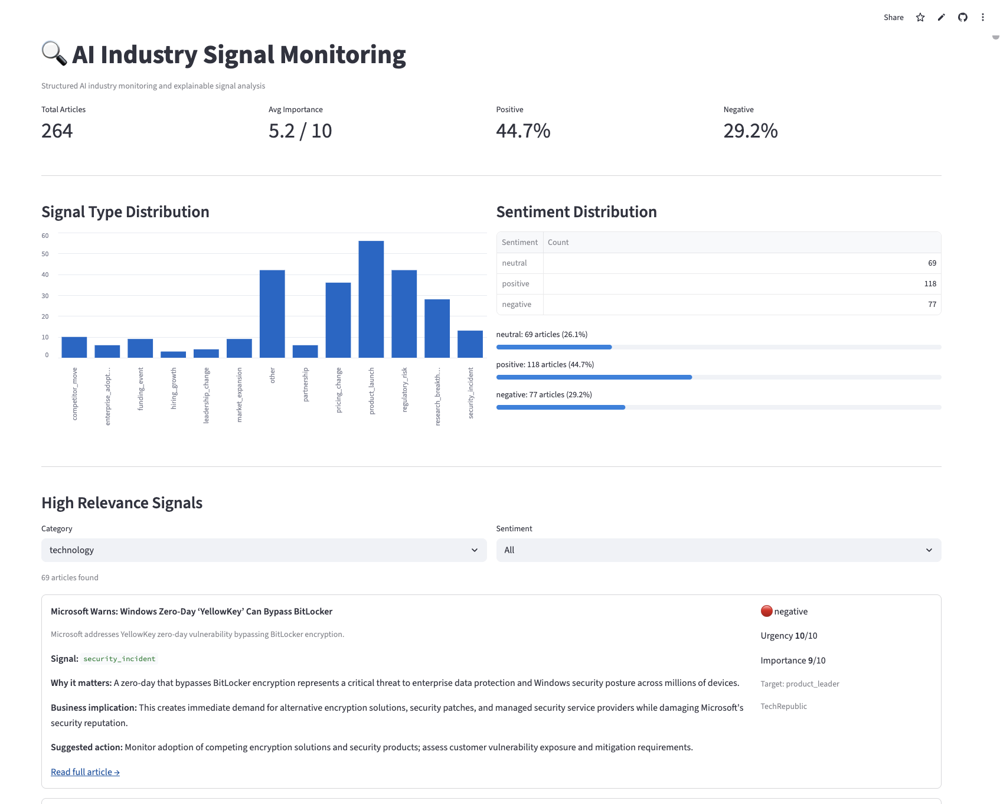

# Nestor Insight
AI-powered BD and market signal intelligence for the AI industry.

## What It Does

Nestor Insight automatically monitors 10 AI industry news sources and uses Claude AI to extract structured business signals from every article. Each signal goes beyond headlines — it includes a concise explanation of why it matters, what the business implication is, a suggested action for your team, and the target persona it's most relevant to. The result is an actionable intelligence feed, not a news aggregator.

## Live Demo

Dashboard: https://pan00051appio-pqyrbnk2v6hdj8sqzl9rsp.streamlit.app  
API docs: https://web-production-ee21e.up.railway.app/docs

## Screenshot



## Example Signal Flow

```
OpenAI releases new flagship model
↓ Signal Type: competitor_move
↓ Why it matters: Shifts enterprise AI procurement decisions across the market
↓ Business implication: Increased competitive pressure on existing AI vendors and tooling providers
↓ Suggested action: Monitor enterprise customer sentiment and evaluate positioning against new capabilities
↓ Target persona: product_leader | Urgency: 8/10
```

## How It Works

```
RSS Feeds (10 AI industry sources)
        ↓
   News Ingestion
        ↓
  Claude AI Analysis
        ↓
Signal Structuring
  - signal_type
  - why_it_matters
  - business_implication
  - suggested_action
  - target_persona
  - urgency
        ↓
  FastAPI Backend
        ↓
Streamlit Dashboard
```

## Signal Types

`funding_event` · `product_launch` · `leadership_change` · `market_expansion` · `partnership` · `hiring_growth` · `regulatory_risk` · `competitor_move` · `enterprise_adoption` · `security_incident` · `pricing_change` · `research_breakthrough` · `other`

## Tech Stack

| Layer | Technology |
|-------|-----------|
| Data ingestion | feedparser, httpx |
| AI analysis | Anthropic Claude (Haiku) |
| Database | Supabase (PostgreSQL) |
| API | FastAPI + Pydantic |
| Dashboard | Streamlit |
| Deployment | Railway + Streamlit Cloud |

## Setup

**Requirements:** Python 3.11+, uv

```bash
git clone https://github.com/pan00051/project-nestor-insight
cd project-nestor-insight
uv venv --python python3.11
source .venv/bin/activate
uv sync
```

Create `.env`:

```
SUPABASE_URL=your_supabase_url
SUPABASE_KEY=your_supabase_key
ANTHROPIC_API_KEY=your_anthropic_key
```

Run the database migrations in the Supabase SQL Editor:

1. `sql/sprint3_business_signals.sql`
2. `sql/sprint5_analysis_state.sql`

## Usage

```bash
# Preview all sources without writing
python -m app.collector.rss_collector --dry-run

# Collect all sources
python -m app.collector.rss_collector

# Preview historical coverage without writing
python -m app.collector.wordpress_backfill \
  --target 1000

# Import historical articles after reviewing the preview
python -m app.collector.wordpress_backfill \
  --target 1000 \
  --write

# Inspect one source safely
python -m app.collector.rss_collector \
  --source "MIT Technology Review" \
  --max-per-feed 10 \
  --dry-run

# Preview the next batch (no Claude calls or database writes)
python -m app.analyzer.ai_analyzer --limit 100 --dry-run

# Analyze the next relevant batch
python -m app.analyzer.ai_analyzer --limit 100

# Start API
uvicorn app.api.main:app --port 8000

# Start Dashboard
streamlit run app/dashboard/streamlit_app.py
```

The analyzer defaults to a 100-article batch and uses a local AI-relevance
filter before making paid Claude calls. Use `--include-low-relevance` only when
you intentionally want to analyze every pending article. Use `--retry-failed`
to retry failed API/validation attempts. Combine `--reprocess-skipped` with
`--include-low-relevance` to deliberately reconsider previously skipped rows.

The collector uses a 15-second timeout, three fetch attempts, connection reuse,
batched URL/content-hash deduplication, and per-source health statistics.
The primary historical backfill command queries the TechCrunch public archive
in pages, applies the same local AI-relevance and deduplication rules, respects
rate limits, and is preview-only unless `--write` is supplied. An experimental
GDELT date-window importer is also available as
`app.collector.historical_backfill`, but the public endpoint may enforce shared
rate limits. Imported rows enter the persistent `pending` analysis queue; run
the analyzer separately after checking the import summary.

## Roadmap

- [ ] Automated scheduling (APScheduler)
- [ ] Semantic search (pgvector + RAG)
- [ ] Company signal pages
- [ ] Weekly BD intelligence digest
- [ ] Multi-source expansion (LinkedIn, SEC filings)

## About

Built as an AI PM portfolio project. Demonstrates end-to-end AI product development:
signal intelligence design, LLM workflow integration, API architecture, and data visualization.
